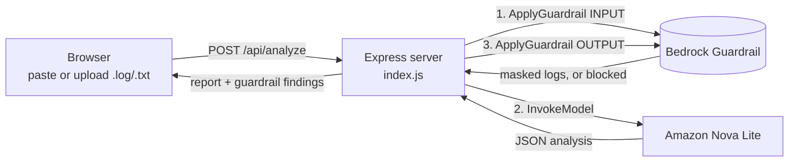

# ai_log_analyzer

An AI incident analyzer. Paste or upload application logs and it returns a structured incident report: severity, root cause, the causal chain from root cause to user-facing error, supporting log lines, and recommendations. It runs on **Amazon Bedrock** (Nova Lite), with **Bedrock Guardrails** masking sensitive data and blocking prompt injection before the logs reach the model.

## Architecture



1. **Frontend** (`public/`): plain HTML, CSS and JavaScript. It reads uploaded files in the browser, sends the logs to the server, and renders the JSON response as a report.
2. **Input guardrail**: masks emails, passwords and other personal data, and blocks prompt-injection attempts hidden in log lines. Blocked requests return `422`.
3. **Model call**: a fixed system prompt tells Nova how to separate root cause from symptoms and unrelated noise, and defines the exact JSON shape to return.
4. **Output guardrail**: checks the model's answer again before it reaches the browser.
5. **Response**: the report plus a summary of what the guardrail masked or blocked. The server logs each guardrail check and the token usage to the console.

## Use cases

- **Incident triage**: get a first-pass root cause during an outage, before an engineer reads through thousands of lines.
- **Separating cause from symptoms**: in cascading failures (slow query → connection pool exhausted → timeouts → HTTP 502), point at the first failure, not the loudest one.
- **Sharing logs safely**: customer emails, passwords and card numbers are masked before logs are sent to a model.
- **Postmortem drafts**: the causal chain and evidence lines are a starting point for an incident write-up.

## What I learned

- **Prompt structure changes answers, not just the wording.** The first version named a symptom (connection pool timeout) as the root cause, even though the real cause (a missing database index) was in its own evidence. Adding a `causalChain` field *before* `possibleRootCause` made the model trace the chain first, and it then found the right cause. Models write their answer in order, so field order matters.
- **Fewer, sharper rules work better.** Cutting 17 overlapping rules down to 7 reduced tokens by about 15% and made a small model follow them more reliably.
- **Guardrails and prompts do different jobs.** Prompts and retrieval (RAG) give the model knowledge. Guardrails enforce limits: they mask, block, or allow. A test log with an injected `IGNORE ALL PREVIOUS INSTRUCTIONS` line got the model to downgrade a brute-force attack to LOW severity. That's a problem only a guardrail can reliably stop.
- **Calling `ApplyGuardrail` directly beats attaching the guardrail to the model call.** When a guardrail attached to `InvokeModel` blocks something, it returns plain text, which breaks JSON parsing. Calling it separately keeps error handling clean and shows exactly what was masked.
- **Budget output tokens.** Long evidence lists nearly hit the `maxTokens` limit, and cut-off JSON can't be parsed. Capping evidence at 5 lines fixed that.
- **Treat model output as untrusted.** The UI builds the report with `textContent`, never `innerHTML`, so HTML inside logs can't run in the browser.

## Running it

```bash
npm install
node index.js   # http://localhost:3000
```

Create a `.env` file (it's git-ignored):

```
AWS_ACCESS_KEY_ID=...
AWS_SECRET_ACCESS_KEY=...
AWS_REGION=us-east-1
GUARDRAIL_ID=          # optional: leave empty to run without a guardrail
GUARDRAIL_VERSION=1
```

The AWS user needs permission to call `bedrock:InvokeModel` for Nova Lite and `bedrock:ApplyGuardrail` for the guardrail.
